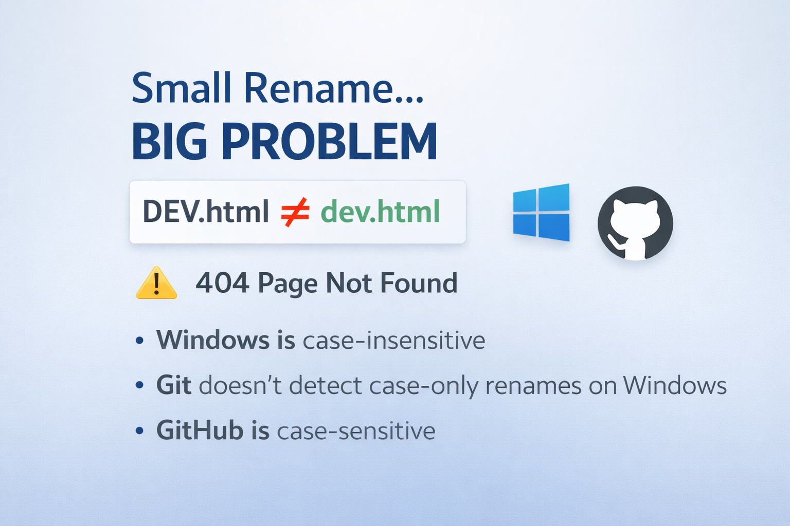

## [👈](../)

# 🚨 One filename change. Zero errors. Production broken.

**A small Git detail taught me a production-level lesson the hard way.**

I recently ran into a subtle issue while working with Git on Windows. It looked harmless at first — until it showed up in production.

I had a file named `DEV.html`.
I pushed it to GitHub and everything worked as expected.

Later, I renamed it locally to `dev.html` (just a case change) and pushed again.
No errors. No warnings. Everything looked fine.

But in production, links like `<a href="dev.html">` started returning **404 – Page Not Found**.

After some digging, I realized GitHub still had the file named `DEV.html`.

---

🔍 **What was happening?**
This isn’t a Git bug, but a cross-platform design limitation:

* Windows filesystems are **case-insensitive**
* Git on Windows doesn’t detect **case-only renames**
* GitHub runs on Linux, which **is case-sensitive**

So Git never recorded the rename, and GitHub never received it.

---

⚠️ **Why this matters**

In small projects, this is easy to miss.
In larger projects, it can silently break navigation and cause production-only bugs — the classic *“works on my machine”* problem.

---

✅ **What I learned**

* Always use lowercase filenames
* Use `git mv` when renaming files
* Enforce naming rules with CI or pre-commit hooks

Sharing this in case it helps someone avoid a similar issue.